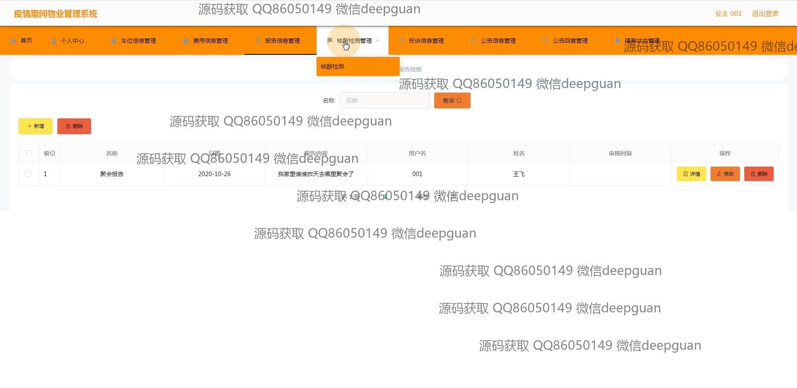
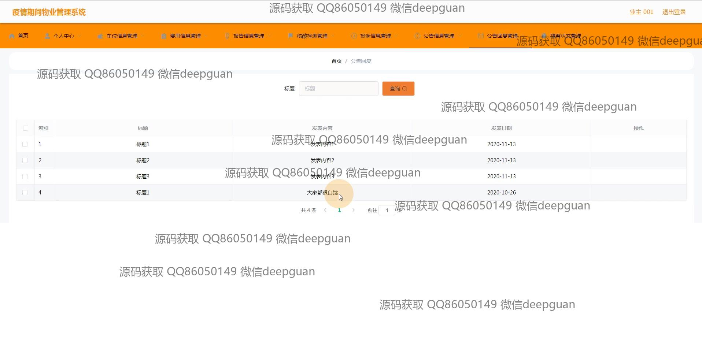

<h1 align="center">的疫情期间物业管理系统vue前端</h1>

## 简介
疫情期间物业管理系统：角色分为管理员、业主；功能包括用户登录、访客登记、住户信息管理、费用管理、核酸检测管理、投诉和公告信息管理等，提升物业管理效率和安全性。    --计算机毕业设计源码；毕设源码；java毕业设计源码

## 联系方式

<h3 align="center">获取完整代码与数据库文件 + 微信：deepguan QQ: 86050149 QQ群: 783742310</h3>

<h3 align="center">可帮忙远程部署 包运行成功！提供远程部署、修改代码、设计文档指导、代码讲解等服务！</h3>

## 功能介绍（完整见运行截图）
管理员：登录界面允许管理员登录系统，通过选择角色可以进行身份验证。管理员可以管理住户信息、核酸检测报告、公告、访客登记、车位、费用等信息。提供新增、删除、修改和审核功能，以便高效处理各种物业事务。系统支持信息搜索和分页功能，帮助管理员快速找到需要的信息。管理隔离状态和投诉信息，确保社区安全。用户：用户可以通过登录界面访问系统，选择“业主”角色进行登录。用户可以查询个人信息、健康状况报告、和访客登记。用户还可输入和查看核酸检测报告、访客信息和车位信息等。用户有权提交和取消费用管理、举报和投诉信息。用户中心还提供密码修改、访问通知和公告的功能，以便及时获取最新的管理资讯和社区公告。

## 运行截图

本代码来源于网络,仅供学习参考使用!

